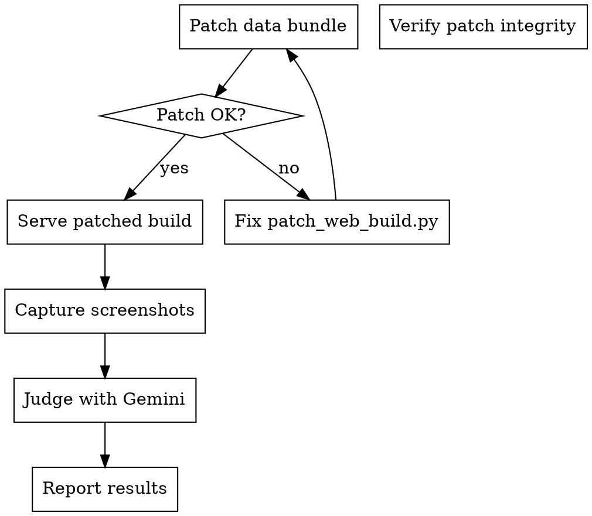

# Reskin Verify

Patch reskinned assets into a Wesnoth Emscripten web build, serve it, capture screenshots via Playwright, and judge visual quality + theme adherence via Gemini CLI.

## When to Use

- After running the reskin pipeline (`reskin.py`) and producing output assets
- When you need to visually verify reskinned assets look correct in-game
- When checking palette swap or AI reskin quality before committing or shipping

## When NOT to Use

- Just running the reskin pipeline (use `reskin.py` directly)
- Unit testing reskin code (use `pytest utils/reskin/tests/`)

## Prerequisites

- Reskinned assets in an output directory (e.g., `output/cyberpunk/`)
- A web build bundle in `output/web-build-bundles/<latest>/build/`
- Playwright installed (`npx playwright --version`)
- Gemini CLI installed (`gemini --version`)
- Docker available for isolated Playwright runs (preferred)

## Process



## Step 1: Patch the Web Build

```bash
python3 utils/reskin/patch_web_build.py \
  --build-dir output/web-build-bundles/<LATEST>/build \
  --reskin-dir <RESKIN_OUTPUT_DIR> \
  --output-dir /tmp/wesnoth-reskin-build
```

Replace `<LATEST>` with the most recent bundle (e.g., `E75-20260222T082833Z`).
Replace `<RESKIN_OUTPUT_DIR>` with the reskin output (e.g., `/tmp/reskin-test/cyberpunk`).

### Patch Integrity Check

<HARD-GATE>
ALWAYS verify patch integrity before serving. A corrupt data file causes WASM RuntimeError: unreachable at load time.
</HARD-GATE>

```bash
python3 -c "
import json, re, os
js = open('/tmp/wesnoth-reskin-build/wesnoth.data.js').read()
m = re.search(r'\"files\":\s*(\[.*?\])', js, re.DOTALL)
files = json.loads(m.group(1))
data_size = os.path.getsize('/tmp/wesnoth-reskin-build/wesnoth.data')
last = files[-1]
expected_end = last['end']
# Verify: last file's end offset must match actual data file size
assert expected_end == data_size, f'MISMATCH: manifest ends at {expected_end} but data is {data_size} bytes'
# Verify: remote_package_size in metadata must match
pkg_match = re.search(r'\"remote_package_size\":\s*(\d+)', js)
if pkg_match:
    pkg_size = int(pkg_match.group(1))
    assert pkg_size == data_size, f'MISMATCH: remote_package_size={pkg_size} but data is {data_size}'
print(f'OK: {len(files)} files, data={data_size} bytes, manifest consistent')
"
```

If this fails, the `patch_web_build.py` script has a bug — fix the offset/size calculation before proceeding.

**Known issue:** `remote_package_size` in the `loadPackage()` metadata call must be updated to match the new data file size. The patcher must handle this.

## Step 2: Serve the Patched Build

```bash
cd /tmp/wesnoth-reskin-build && nohup python3 /workspace/wesnoth/utils/dockerbuilds/emscripten/serve_coi.py \
  --port 8040 > /dev/null 2>&1 &
SRV_PID=$!

# Verify server responds
sleep 2 && curl -s -o /dev/null -w "%{http_code}" http://127.0.0.1:8040/
# Expected: 200
```

Run this in the background. Remember to kill `$SRV_PID` when done.

## Step 3: Capture Screenshots

Use the existing Playwright test pattern from `utils/dockerbuilds/emscripten/test_hotseat_playwright.js` as a reference. Key screenshots to capture:

| Screenshot | What to navigate to | What it shows |
|---|---|---|
| `01-title-screen.png` | Load page, wait for canvas | Main menu (verifies game loads) |
| `02-battle-scene.png` | Start a game, enter combat | Unit sprites + attack icons in context |
| `03-unit-info.png` | Click a unit | Portrait + attack icon list |

### Capture script

Create a temporary Playwright script or reuse the hotseat test pattern:

```bash
SCREENSHOT_DIR=/tmp/reskin-screenshots
mkdir -p "$SCREENSHOT_DIR"

# Option A: Direct Playwright (if installed locally)
NODE_PATH=$(npm root -g 2>/dev/null || echo /opt/wesnoth-playwright-node/node_modules) \
  node utils/dockerbuilds/emscripten/test_hotseat_playwright.js \
  http://127.0.0.1:8040/ "$SCREENSHOT_DIR"

# Option B: Docker (more reliable, isolated)
# See utils/dockerbuilds/emscripten/test_hotseat_docker.sh for the full pattern
```

## Step 4: Judge with Gemini

### Before/After Comparison

Copy originals alongside reskinned screenshots for comparison:

```bash
# Capture originals from unpatched build for comparison
# (serve the original build on a different port, screenshot same scenes)
```

### Gemini Visual Judgment

```bash
VERDICT=$(gemini -p "$(cat <<'PROMPT'
You are a visual quality judge for game asset reskinning.

Compare the screenshots in this directory. Files prefixed 'original-' are the
unmodified game. Files prefixed 'reskinned-' are the themed version.

Evaluate on two axes:

1. THEME ADHERENCE (0-10): Do the reskinned assets match the target theme?
   Look at color palette, mood, visual consistency with the theme description.
   Theme: [INSERT THEME DESCRIPTION HERE]

2. QUALITY PRESERVATION (0-10): Are the reskinned assets clean?
   Check for: transparency artifacts, color banding, broken animation frames,
   visual inconsistency between related sprites, readability of icons.

For each screenshot pair, provide:
- Theme score and reasoning
- Quality score and reasoning
- Specific issues found (if any)

End with an overall PASS/FAIL recommendation.
PROMPT
)" \
  -m gemini-3.1-pro-preview \
  --include-directories "$SCREENSHOT_DIR" \
  --yolo \
  --output-format text 2>/dev/null)

echo "$VERDICT"
```

### Interpreting Results

| Gemini Score | Action |
|---|---|
| Theme 8+ and Quality 8+ | Ship it |
| Theme 6-7 or Quality 6-7 | Review specific issues, iterate on theme config |
| Either below 6 | Significant problems — check palette ranges, prompt wording |

## Step 5: Cleanup

```bash
kill $SRV_PID 2>/dev/null
rm -rf /tmp/wesnoth-reskin-build /tmp/reskin-screenshots
```

## Common Issues

| Symptom | Cause | Fix |
|---|---|---|
| `RuntimeError: unreachable` on load | Data file / manifest size mismatch | Run integrity check (Step 1), fix `patch_web_build.py` |
| Black screen after load | WASM threading not enabled | Ensure `serve_coi.py` is used (sets COI headers) |
| Screenshots are blank/black | Canvas not ready yet | Increase `waitForCanvas` timeout in Playwright |
| Gemini says "I don't see images" | Wrong `--include-directories` path | Verify screenshot PNGs exist at the path |
| Icons look identical to original | Palette swap didn't match any colors | Check color family ranges in `palette_swap.py` |

## Quick Reference

```bash
# Full verify pipeline (one-liner)
python3 utils/reskin/patch_web_build.py \
  --build-dir output/web-build-bundles/E75-20260222T082833Z/build \
  --reskin-dir /tmp/reskin-test/cyberpunk \
  --output-dir /tmp/wesnoth-reskin-build \
&& cd /tmp/wesnoth-reskin-build \
&& nohup python3 /workspace/wesnoth/utils/dockerbuilds/emscripten/serve_coi.py --port 8040 > /dev/null 2>&1 &
```
